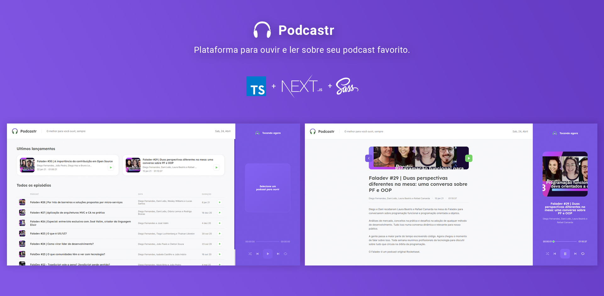

<h1 align="center">NextJS Podcastr</h1>

 <a href="#objetivo">Objetivo</a> •
 <a href="#preview">Preview</a> •
 <a href="#funcionalidades">Funcionalidades</a> • 
 <a href="#tecnologias">Tecnologias utilizadas</a> • 
 <a href="#instalacao">Instalação</a> • 
 <a href="#autor">Autor</a>

<h3 id="objetivo">🔖 Objetivo</h3>

🚀 Projeto desenvolvido para fins de estudo do framework Next.js

<h3 id="preview">🖥️ Preview do projeto</h3>

<h3 id="funcionalidades">✅ Funcionalidades</h3>

- [x] Controle do player (Tocar, Pausar, Anterior, Próximo, Aleatório, Repetir)
- [x] Pagina de detalhe do episódio
- [x] Lista dos Episódios (Todos / Últimos lançamentos)
- [x] getStaticProps / getStaticPaths

<h3 id="instalacao">🎲 Rodando o projeto</h3>

#### Pré-requisitos

Antes de começar, você vai precisar ter instalado em sua máquina as seguintes ferramentas:
[Git](https://git-scm.com), [Node.js](https://nodejs.org/en/).

#### Clone este repositório

`$ git clone <https://github.com/eriick505/next-podcastr.git>`

#### Acesse a pasta do projeto no terminal/cmd

`$ cd next-podcastr`

#### Instale as dependências

`$ npm install`

#### Execute a aplicação em modo de desenvolvimento

`$ npm run dev`

#### Execute a aplicação em modo de desenvolvimento

`Àbra http://localhost:3000 com o seu navegador para ver o resultado.`

<h3 id="tecnologias">⚡ Tecnologias/Pacotes utilizado(a)s</h3>

- <a href="https://www.typescriptlang.org/" target="_blank">TypeScripts</a>
- <a href="https://nextjs.org/" target="_blank">Next.JS</a>
- <a href="https://sass-lang.com/" target="_blank">SASS</a>
- <a href="https://github.com/typicode/json-server" target="_blank">JSON Server</a>
- <a href="https://date-fns.org/" target="_blank">Date-fns</a>
- <a href="https://slider-react-component.vercel.app/" target="_blank">rc-slider</a>

<h3 id="autor">😄 Autor</h3>

Desenvolvido por <a href="https://github.com/eriick505/"><b>Erick Santos</b></a>  
  👋🏽 Entre em contato!

 

